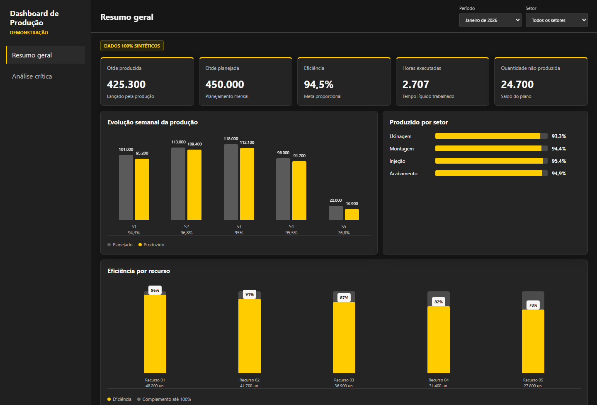
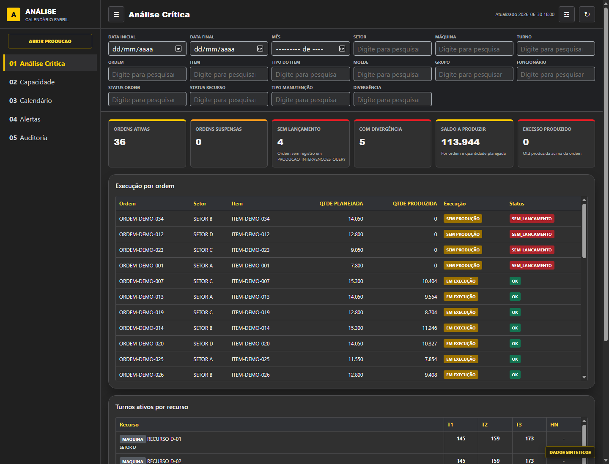
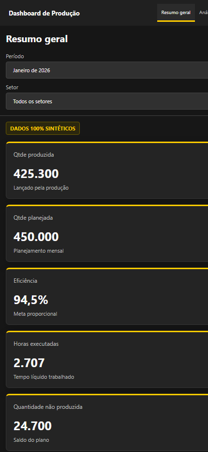
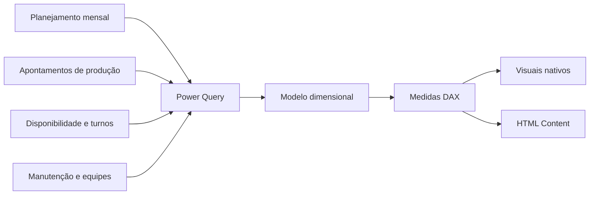

# Calendário Fabril e Dashboard de Produção

**Case de Business Intelligence industrial com Power BI, Power Query, DAX, Excel/VBA e visuais HTML.**

O projeto combina modelagem dimensional, automação, qualidade de dados e análise de operações para transformar diferentes rotinas industriais em uma visão integrada de planejamento e desempenho.

> Todos os dados publicados são sintéticos. Arquivos operacionais, planilhas originais, nomes, matrículas, ordens, itens, quantidades e o modelo PBIX com dados reais não fazem parte do repositório.

## Visão do case

O desafio foi estruturar uma solução para integrar planejamento mensal, execução da produção, disponibilidade, manutenção e composição de equipes sem misturar granularidades ou duplicar resultados.

A solução permite investigar perguntas como:

- quanto foi planejado e produzido por período, setor e recurso;
- qual foi a eficiência no tempo efetivamente trabalhado;
- quais ordens não possuem lançamento ou apresentam divergência;
- quanto da capacidade planejada ainda está ociosa;
- como grupos e pessoas participaram da produção;
- como manutenção e paradas afetaram a meta proporcional.

## Demonstração

[Abrir dashboard de Produção](https://nnathanvieira.github.io/gestao-operacional-bi/demo/dashboard_demo.html) · [Abrir Análise Crítica](https://nnathanvieira.github.io/gestao-operacional-bi/demo/analise_critica.html)

A demonstração reproduz a mesma composição do visual HTML Content usado no Power BI. São onze páginas interligadas, com filtros por período, setor, máquina, turno, ordem, item, grupo e funcionário. Todo o conteúdo publicado é sintético.

**Produção:** Resumo Geral, Produção Real, Comparativo de Meses, Manutenção, Refugo e Pessoas e Grupos.

**Análise:** Análise Crítica, Capacidade, Calendário Fabril, Alertas e Auditoria.

| Resumo geral | Análise crítica |
| --- | --- |
|  |  |

<details>
<summary>Visualização responsiva</summary>



</details>

## Competências demonstradas

- levantamento e tradução de regras de negócio industriais;
- preparação e normalização de dados com Power Query M;
- modelagem dimensional e relacionamentos `1:*`;
- medidas DAX e inteligência temporal;
- análise de eficiência, capacidade, ociosidade e qualidade;
- automação de rotinas operacionais com Excel/VBA;
- desenvolvimento de visuais personalizados em HTML, CSS e JavaScript;
- anonimização e governança para publicação segura.

## Arquitetura



O modelo usa dimensões conformadas para data, ordem, item, máquina, turno, molde e funcionário. As tabelas fato mantêm granularidades separadas para produção, ordens, disponibilidade, manutenção, equipes, histórico e alertas.

## Decisões técnicas

- A execução real tem prioridade sobre fontes auxiliares de sistema.
- A eficiência compara quantidade válida com a meta proporcional às horas líquidas trabalhadas.
- Paradas de máquina reduzem o tempo produtivo antes do cálculo da meta.
- Lançamentos duplicados de duração são rateados proporcionalmente quando representam o mesmo recurso, data e turno.
- Metas por quantidade de pessoas são aplicadas somente nos contextos em que essa regra é válida.
- Ordens sem setor coerente, duração, quantidade ou meta identificada geram alertas de qualidade.
- O planejamento semanal é proporcional às horas disponíveis, preservando a distribuição mensal.
- Fatos não se relacionam diretamente; dimensões filtram fatos em direção única.

## Estrutura

```text
demo/
  dashboard_demo.html       operação e produção
  analise_critica.html      capacidade, alertas e auditoria
  demo-data.js              massa sintética compartilhada
  build-demo.ps1            gera as demos a partir do HTML Content
docs/
  ARQUITETURA.md            fluxo técnico e responsabilidades
  PRIVACIDADE.md            política de anonimização
src/
  excel-vba/                automações do calendário fabril
  powerbi/                  Power Query, modelo, DAX e HTML
```

## Tecnologias

`Power BI` · `Power Query M` · `DAX` · `Excel` · `VBA` · `HTML` · `CSS` · `JavaScript` · `Modelagem dimensional`

## Como explorar

1. Comece pela [demonstração interativa](https://nnathanvieira.github.io/gestao-operacional-bi/demo/dashboard_demo.html).
2. Consulte a arquitetura em [`docs/ARQUITETURA.md`](docs/ARQUITETURA.md).
3. Veja as transformações em [`src/powerbi/01_POWER_QUERY_TRATAMENTO.md`](src/powerbi/01_POWER_QUERY_TRATAMENTO.md).
4. Analise o modelo em [`src/powerbi/02_MODELO_DADOS.md`](src/powerbi/02_MODELO_DADOS.md).
5. Consulte as medidas e visuais na pasta [`src/powerbi`](src/powerbi).

## Privacidade

O PBIX, os arquivos Excel originais e os documentos internos foram deliberadamente excluídos. A publicação demonstra arquitetura, regras, tratamento e apresentação sem permitir reconstruir dados reais da operação. Consulte [`docs/PRIVACIDADE.md`](docs/PRIVACIDADE.md).
