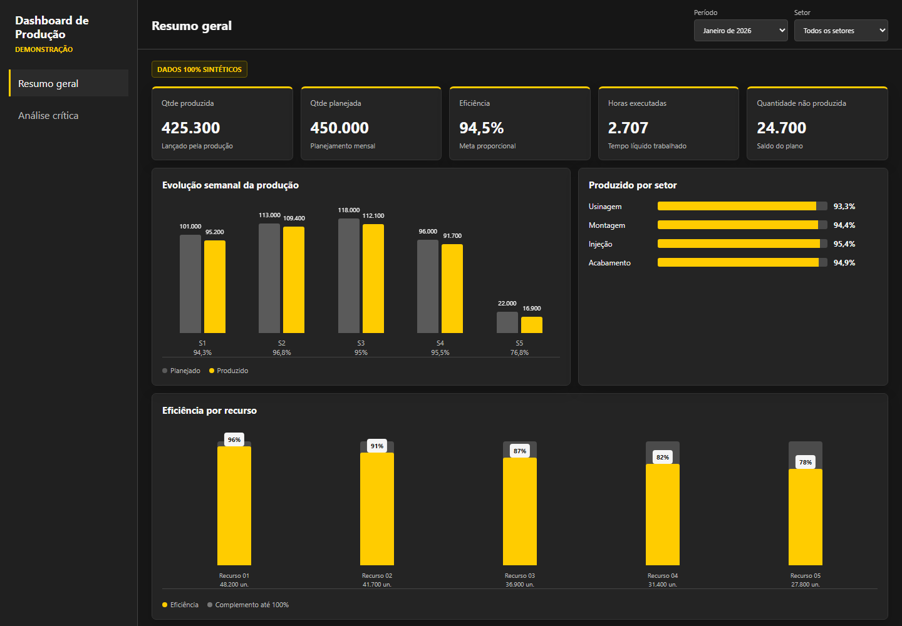
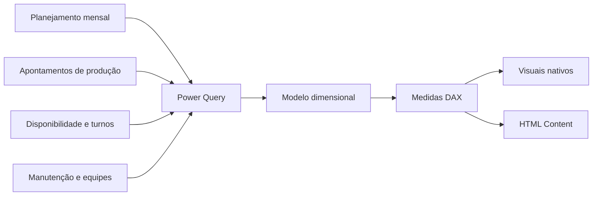

# Calendário Fabril e Dashboard de Produção

Solução de planejamento e acompanhamento industrial construída com Excel/VBA,
Power Query, DAX e visuais HTML no Power BI.

> Todos os dados apresentados neste repositório são sintéticos. Arquivos
> operacionais, planilhas originais, nomes, matrículas, ordens, itens,
> quantidades e o modelo PBIX com dados reais não fazem parte da publicação.

## Visão geral

O projeto integra planejamento mensal, execução da produção, disponibilidade,
manutenção e composição de equipes. O modelo foi desenhado para responder a
perguntas operacionais como:

- quanto foi planejado e produzido por período, setor e recurso;
- qual foi a eficiência no tempo efetivamente trabalhado;
- quais ordens não possuem lançamento ou apresentam divergência;
- quanto da capacidade planejada ainda está ociosa;
- como grupos e pessoas participaram da produção;
- como manutenção e paradas afetaram a meta proporcional.

## Demonstração



Abra [`demo/dashboard_demo.html`](demo/dashboard_demo.html) para explorar uma
versão independente com filtros e dados totalmente fictícios.

## Arquitetura



O modelo usa dimensões conformadas para data, ordem, item, máquina, turno,
molde e funcionário. As tabelas fato mantêm granularidades separadas para
produção, ordens, disponibilidade, manutenção, equipes e alertas.

## Regras centrais

- A execução real tem prioridade sobre fontes auxiliares de sistema.
- A eficiência compara quantidade válida com a meta proporcional às horas
  líquidas trabalhadas.
- Paradas de máquina reduzem o tempo produtivo antes do cálculo da meta.
- Lançamentos duplicados de duração são rateados proporcionalmente quando
  representam o mesmo recurso, data e turno.
- Metas por quantidade de pessoas são aplicadas somente nos contextos em que
  essa regra é válida.
- Ordens sem setor coerente, duração, quantidade ou meta identificada geram
  alertas de qualidade.
- O planejamento semanal é proporcional às horas disponíveis, preservando a
  distribuição do mês mesmo quando um filtro exibe apenas parte do período.

## Estrutura

```text
demo/
  dashboard_demo.html       demonstração interativa e sintética
  dados_sinteticos.json     amostra estrutural sem dados reais
docs/
  ARQUITETURA.md            fluxo técnico e responsabilidades
  PRIVACIDADE.md            política de anonimização da publicação
src/
  excel-vba/                automações do calendário fabril
  powerbi/                  Power Query, modelo, DAX e HTML
```

## Tecnologias

- Excel e VBA para manutenção do calendário operacional;
- Power Query M para ingestão, tipagem, normalização e regras;
- modelo dimensional no Power BI;
- DAX para indicadores, reconciliação e inteligência temporal;
- HTML, CSS e JavaScript gerados por medida para visuais personalizados.

## Como adaptar

1. Crie suas próprias fontes seguindo os nomes de colunas descritos em
   [`docs/ARQUITETURA.md`](docs/ARQUITETURA.md).
2. Configure o parâmetro local `pPastaDashboard`.
3. Implemente as consultas descritas em
   [`src/powerbi/01_POWER_QUERY_TRATAMENTO.md`](src/powerbi/01_POWER_QUERY_TRATAMENTO.md).
4. Monte os relacionamentos conforme
   [`src/powerbi/02_MODELO_DADOS.md`](src/powerbi/02_MODELO_DADOS.md).
5. Adicione as medidas e os visuais HTML da pasta `src/powerbi`.

## Limites da publicação

O arquivo PBIX, os arquivos Excel originais e os documentos internos foram
deliberadamente excluídos. A publicação demonstra arquitetura, regras,
tratamento e apresentação, sem permitir reconstruir os dados da operação.
